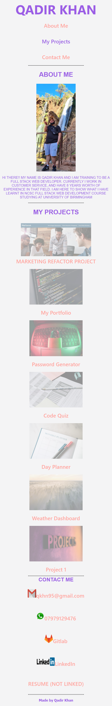

# my-portfolio

## Updates

## 1 - Basic set up of how I want website to look

Put in the basic web design of how i want the page to look, header, nav bar, main, footer

## 2 - Added navigation bar, updating css

Added the navigation bar, also updating the CSS value to make the nav bar flex layout

Below is an image of the nav bar in media mode

## 3 - Added contacts section at bottom and image for about me section

Added a contact me section with workable links which open in a new tab

## 4 - Made sure nav links are now operational

Nav links now go to desired section of the webpage

## 5 - Footer now complete, need to start on My Projects section

## 6 - Changed Footer section as causing issues in media display mode

Footer was not working on media display mode so this has now changed to section element, and footer has now changed. All is fully operational now

## 7 - Added Project cards section

Added the individual project cards on to webpage. Having issues with flexbox as cards are overlapping the page. However cards are working media query mode

## Technologies

- HTML
- CSS
- Github Pages
- coolers.co
- unsplash.com
- Paint (to edit screenshots)

## Screenshots

### DESKTOP VIEW

### MOBILE VIEW

